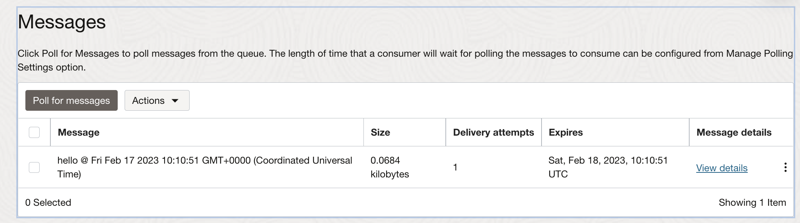

## OCI Queue example in NodeJS with GitHub Actions

### Setup secrets to run this example with GitHub Actions:

<ul>
    <li><b>OCI_TENANCY</b>: OCI Tenancy OCID</li>
    <li><b>OCI_USER</b>: OCI User OCID</li>
    <li><b>OCI_FINGERPRINT</b>: OCI User Fingerprint</li>
    <li><b>OCI_KEY</b>: OCI User Private Key</li>
    <li><b>Q_ID</b>: OCI Queue OCID</li>
    <li><b>Q_ENDPOINT</b>OCI Queue Endpoint</li>
</ul>

#### Create Queue and copy the Queue OCID and Enpoint:

When using another <code>region</code> than <code>EU_FRANKFURT_1</code> please modify the 
<a href="https://github.com/mikarinneoracle/oci-queue-node/blob/main/index.js#L10">
<code>index.js</code></a> Line #10 accordingly:

<pre>
const region = common.Region.EU_FRANKFURT_1;
</pre>

#### Setup policies for your user in the tenancy

e.g. <code>Allow &lt;USER_GROUP&gt; to manage queues in compartment &lt;COMPARTMENT&gt;</code>

More on OCI Queue IAM policies: https://docs.oracle.com/en-us/iaas/Content/queue/policy-reference.htm

### Monitor the GitHub action to run:

This example will poll for messages in the queue and finally writes a new message to it.

### Messages on the Queue:

